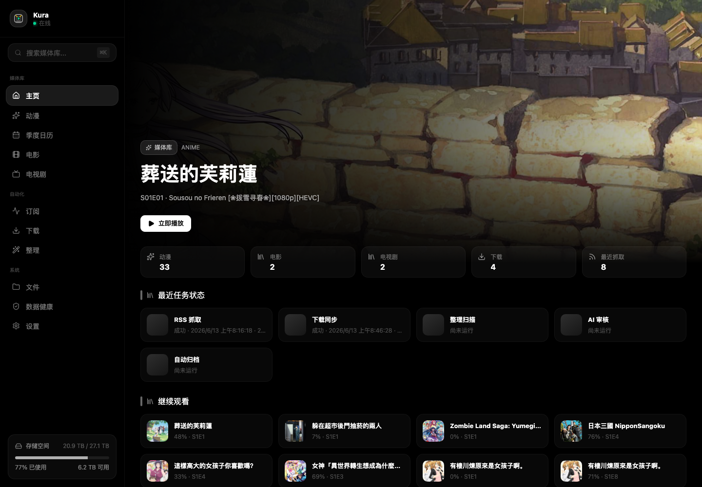
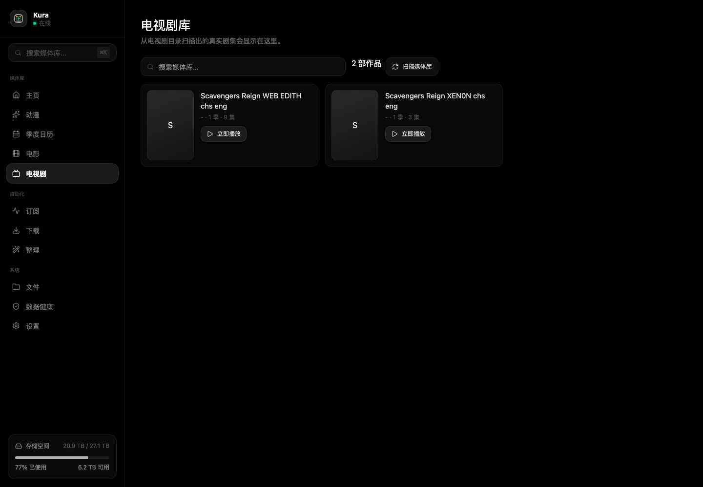
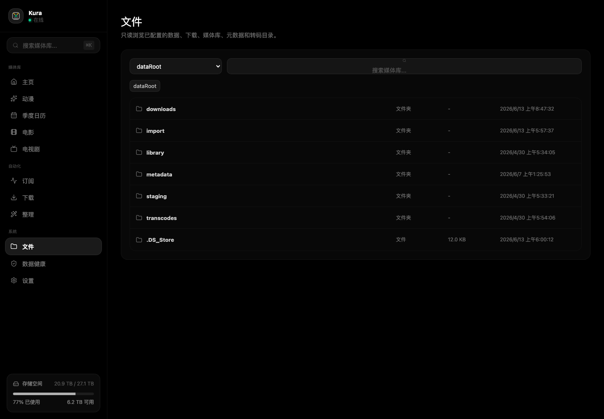
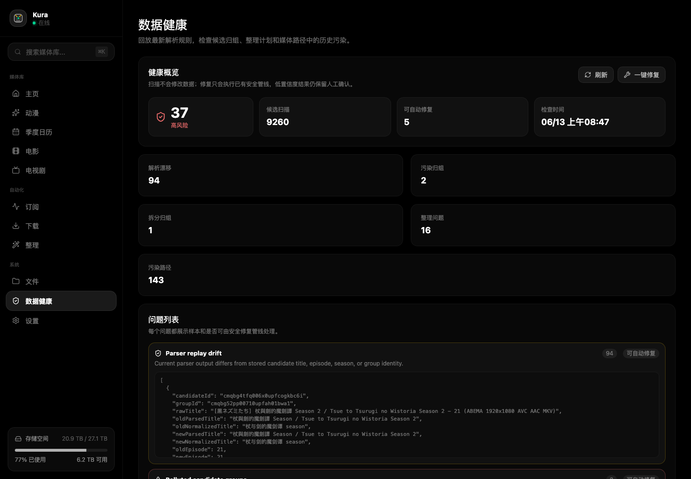

# Kura

[中文](README.md)

Kura is an anime-first media automation system for NAS environments.

It covers RSS subscriptions, BT/magnet downloads, file organization, metadata repair, local artwork caching, data health checks, and browser playback for self-hosted anime-centered media libraries.



## Features

- Anime library: manage content by title, season, and episode with artwork, watch progress, missing episodes, tags, metadata audits, and repair actions.
- RSS subscriptions: manage feeds, parse release candidates, group release variants by title, and decide whether to auto-download or review through subscription strategies.
- Manual intake: add magnet links or `.torrent` files and assign them to anime, movies, TV, or automatic detection.
- Download sync: synchronize BT/magnet tasks through aria2 JSON-RPC with progress, speed, status, source linkage, and failure reasons.
- File organization: generate dry-run organizer plans for downloads and imports before moving files, including target path, match result, confidence, and conflict state.
- Metadata repair: repair titles, aliases, covers, descriptions, season catalogs, and episode mapping through rules, metadata providers, and optional AI assistance.
- Historical backfill: identify missing episodes, subscription ranges, historical candidates, batch releases, and absolute episode numbering cases.
- Local artwork cache: store covers, backdrops, and metadata under the NAS data root.
- Browser playback: support web playback, HLS preparation, subtitles, watch progress, and continue watching.
- Data health checks: inspect historical issues in candidate groups, organizer plans, parsing rules, and media paths, then expose safe repair actions.
- Movies and TV: provide secondary library surfaces and organizer support for non-anime media.
- File browser: read-only browsing for configured NAS roots, downloads, imports, library directories, and metadata directories.
- Internationalized UI: English, Simplified Chinese, and Traditional Chinese.

## Product Screens

### Anime Library

The anime library is Kura's primary surface, organized around titles, seasons, episodes, and watch state.


### TV Library

Movies and TV support existing NAS content and manual imports outside the anime workflow, reusing organizer, metadata, and playback capabilities.



### Subscriptions

The subscription page handles RSS sources, manual intake, candidate grouping, and subscription strategy. Users can control downloads by subtitle group, quality, codec, language, and episode range.


### Downloads

The downloads view mirrors aria2 task state across active, waiting, paused, completed, and failed tasks.


### Organizer

The organizer shows preview plans before files move. High-confidence plans can be automated, while low-confidence or conflicting plans remain in review.


### Files And Data Health

The file browser provides read-only access to configured directories. Data health checks inspect parser drift, candidate pollution, split groups, and organizer issues.





## Workflow

1. Add RSS sources or manually import magnet / `.torrent` files.
2. Kura parses candidates and identifies title, season, episode, subtitle group, quality, codec, and language.
3. Subscription strategies decide whether to auto-download, ignore, or review.
4. aria2 downloads the release while Kura syncs task status and failure reasons.
5. Completed downloads become organizer plans with target paths and risk checks.
6. Executed plans update the library, metadata, local artwork, and playback entries.
7. Data health checks keep detecting historical parsing and organization issues.

## Product Strengths

- Designed for anime release naming instead of treating subtitle groups, seasons, episodes, and release variants as plain filename text.
- Traceable automation across RSS candidates, subscription matches, download tasks, organizer plans, and repair results.
- NAS-safe file operations with preview-first organization and allowed-root path checks.
- Optional AI assistance for candidate grouping, title equivalence, and organizer review without bypassing low-confidence review or path-safety checks.
- Docker Compose and Unraid deployment paths for long-running home server and NAS environments.

## Technology

- Web: Next.js App Router, React, TypeScript
- Database: PostgreSQL, Prisma
- Jobs: separate Node worker, Postgres-backed queue
- Downloader: aria2 JSON-RPC
- Media operations: local file scanning, organizer plans, HLS/transcode directory, local artwork cache
- Deployment: Docker Compose, Unraid directory mapping
- i18n: English, Simplified Chinese, Traditional Chinese

## Quick Start

```bash
cp .env.example .env
npm install
npm run prisma:migrate:dev
npm run dev
```

Start the worker:

```bash
npm run worker
```

Default local URL:

```text
http://localhost:3000/zh-Hans
```

Common commands:

```bash
npm run lint
npm run test
npm run build
```

## Documentation

- [Deployment and local development](docs/deployment.md)
- [Unraid deployment guide](docs/unraid-deployment.md)
- [Subscription strategy roadmap](docs/subscription-strategy-roadmap.md)
- [Historical backfill design](docs/history-backfill-plan.md)
- [Product baseline](docs/kura-product-baseline.md)
- [Development charter](docs/development-charter.zh-CN.md)

## Status

Kura is under active development. Current work focuses on anime RSS/subscription workflows, aria2 download sync, organizer automation, metadata and artwork repair, data health checks, browser playback, and supporting NAS media surfaces for movies, TV, and files.
