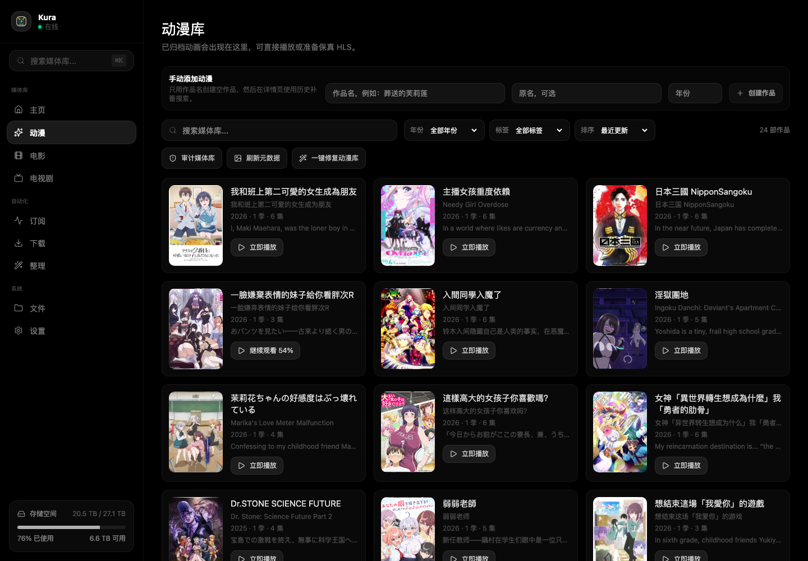
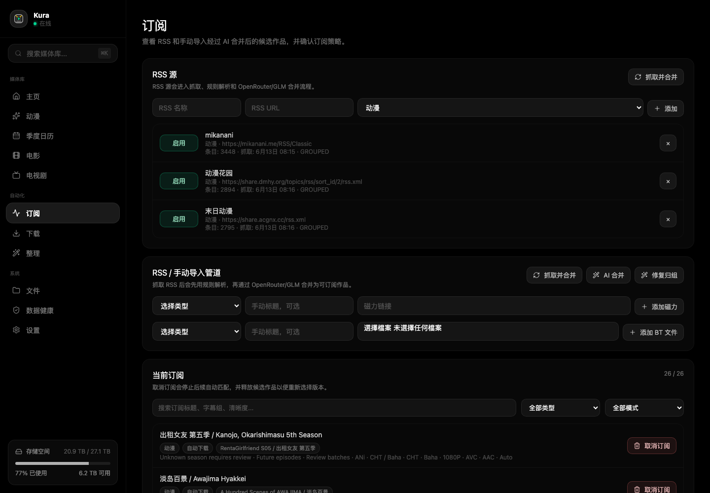
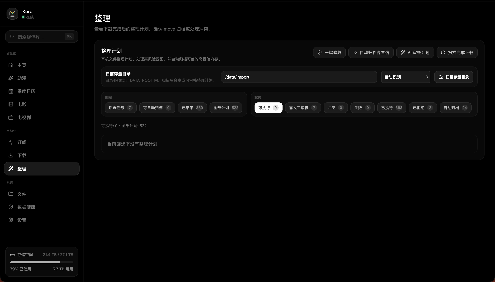
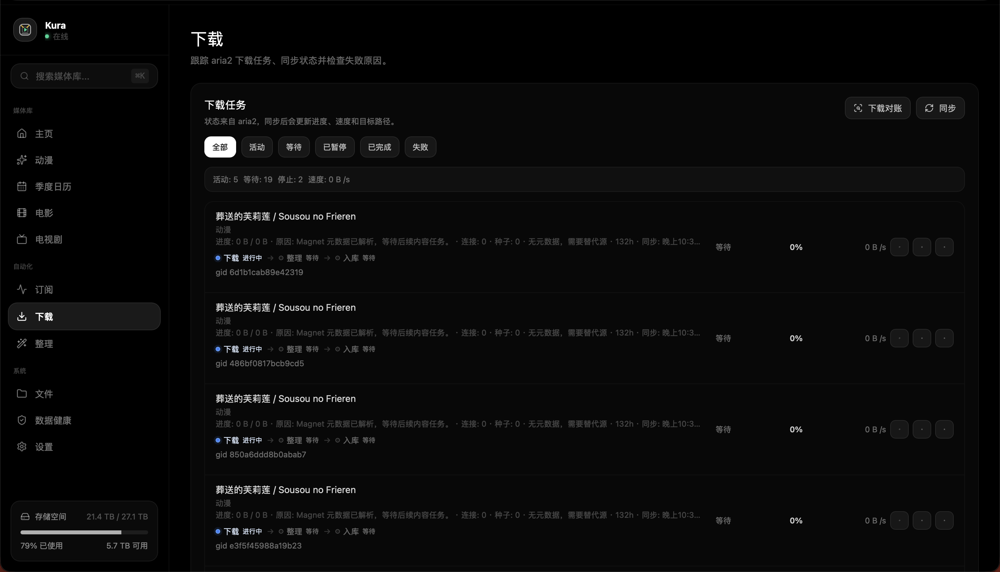

# Kura

[English](README.md)

Kura 是一个以动画内容为核心的 NAS 媒体应用，面向希望在一个自托管界面中完成 RSS 获取、BT/磁力下载、元数据修复、文件整理和浏览器播放的用户。

它的工作方式很直接：资源从 RSS 或手动导入进入系统，Kura 对候选条目进行解析、分组和解释；你选择想订阅的版本，系统再协助把下载完成的文件整理成其他 NAS 媒体应用也容易识别的媒体库结构。

## Kura 能做什么

- 构建以动画为主的媒体库，同时提供电影和电视剧板块。
- 读取 RSS 源，聚合发布候选，并帮助你按字幕组、清晰度、编码和语言版本选择订阅策略。
- 支持手动添加磁力链接和 `.torrent` 文件，可指定动画、电影、电视剧或自动识别。
- 通过 aria2 JSON-RPC 管理 BT/磁力下载。
- 在移动文件前生成整理计划，低置信度或高风险匹配会进入审核，而不是直接静默改名。
- 结合元数据源和可选 AI 能力修复标题、别名、集数、封面和简介。
- 将封面等素材缓存到本地，减少运行时对外部网络图片的依赖。
- 识别缺失集数，并提供历史补番流程。
- 在浏览器中播放视频，支持直连播放、HLS 准备、字幕和观看进度。
- 提供英文、简体中文和繁体中文界面。

## 产品区域

### 媒体库

媒体库是主要浏览入口。动画会按作品、季和集进行归档，并展示封面、播放入口、观看进度、年份筛选、标签和修复工具。

### 订阅

订阅页面用于管理 RSS 源和手动导入。Kura 可以抓取 RSS、解析候选条目、使用 AI 辅助合并分组，并让你只订阅真正想要的发布版本，而不是下载所有变体。

### 整理

下载完成的文件和导入目录会生成整理计划。高置信度计划可以自动处理，模糊或风险较高的计划会保留在页面中，等待审核、重新生成、拒绝或手动执行。

### 下载

下载页面同步 aria2 状态，展示任务进度和失败原因，并区分活跃、等待、暂停、完成和失败任务。

## 为什么做 Kura

动画资源命名经常很混乱：同一作品可能有多语言标题，字幕组命名习惯不同，季度和集数标记不一致，历史补番也经常需要人工判断。Kura 的目标是把这些判断放进产品流程里，而不是散落在脚本、文件名或临时表格中。

长期目标是做一个适合 NAS 的透明媒体工作流：自动化要有用，但每一次文件移动、订阅选择和元数据修复都应该可以检查。

## 文档

- [部署和本地开发](docs/deployment.md)
- [Unraid 部署指南](docs/unraid-deployment.md)
- [订阅策略路线图](docs/subscription-strategy-roadmap.md)
- [历史补番设计](docs/history-backfill-plan.md)
- [产品基线](docs/kura-product-baseline.md)

## 状态

Kura 正在持续开发中。当前实现重点是动画 RSS 工作流、aria2 下载、整理自动化、本地封面缓存和浏览器播放。电影和电视剧支持已经存在，但动画仍然是主要设计目标。
